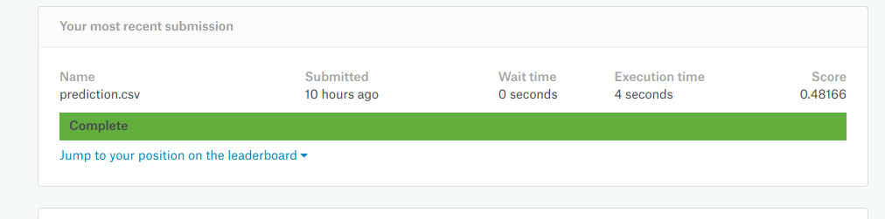

# forest-cover-type
In the problem statement it's asked to predict the forest cover type (the predominant kind of tree cover) from strictly cartographic variables. Trying to classify it with different frameworks & platforms, and trying to compare the results.

In this repository I am focusing on how to use Amazon ML from your local machine. Only Data Source is created through the web interface. If you want to use the GUI, follow these 10 simple steps: 
1. Go to [aws](https://aws.amazon.com/).
2. Sign in to the Console
3. Set region as either US East(Virginia) or EU (Ireland)
4. Save dataset in a S3 Bucket or Amazon Redshift cluster.
5. Click on services -> Machine Learning
6. If you do not have any previously created ML model, click -> Get Started.
7. Standard Setup -> Launch
8. Enter bucket name and datasource name(optional).
9. Create the Data Schema 
10. Enter target variable from your dataset.
11. Review your datasource info.
 
When I used Amazon ML I go this result 

